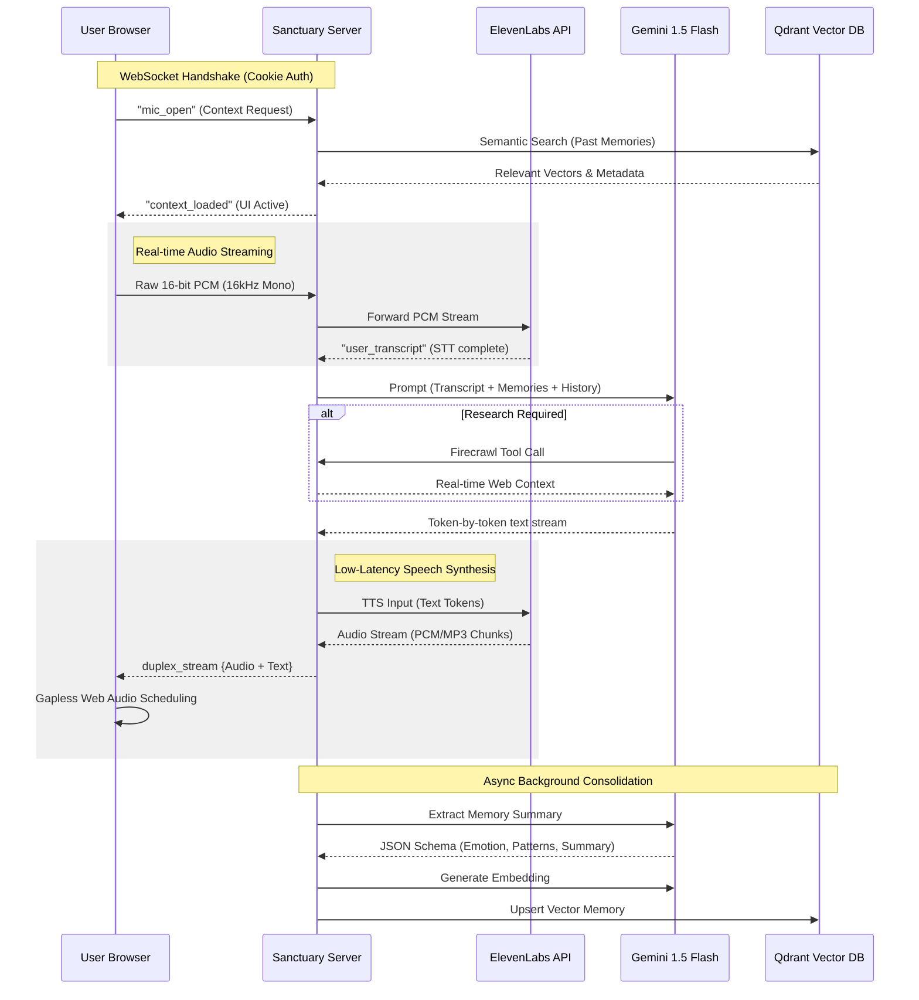

# Sanctuary AI: Personal Voice Agent Engine
### Technical Architecture & System Design

Sanctuary AI is a high-performance, real-time voice agent designed for emotional reflection and mental wellness. It leverages a Retrieval-Augmented Generation (RAG) architecture combined with low-latency bi-directional voice streaming to create a seamless, context-aware conversational experience.

---

## 🏗️ System Architecture

The system is built on a distributed pipeline that synchronizes audio processing, semantic memory retrieval, and LLM orchestration.

### Technical Stack
- **Frontend:** Next.js (App Router), Tailwind CSS, Web Audio API (Manual PCM capture & playback).
- **Backend:** Node.js (Express), WebSocket (WS) for real-time duplex streaming.
- **AI Orchestration:** Google Gemini 2.5 Flash (Reasoning & Tool Calling).
- **Voice Intelligence:** ElevenLabs Conversational AI (Real-time STT & TTS).
- **Persistence:** Prisma (Postgres) for session state; Qdrant for semantic vector memory.
- **Connectivity:** Secure WebSocket Authentication via `HttpOnly` cookie-to-header upgrade.

---

## 🎙️ The Voice Data Pipeline (End-to-End)

---

## 🛠️ Key Technical Implementations

### 1. High-Fidelity Audio Capturing
Most browser `MediaRecorder` implementations inject "containers" (WebM/Opus) which add latency and decoding overhead. Our engine bypasses this by using the **Web Audio API** (`AudioContext`) to:
- Capture audio at the browser's native hardware rate.
- Manually downsample to **16,000Hz (16kHz)**.
- Normalize Float32 samples into **signed 16-bit PCM integers**.
- Stream raw binary chunks via WebSocket, reducing transcription latency by ~400ms.

### 2. Gapless Playback Engine
To prevent the "robotic stutter" caused by playing sequential audio clips, the frontend implements a **Sequential Buffer Queue**:
- Each incoming audio chunk is decoded via `decodeAudioData` (compressed) or parsed as raw PCM.
- Chunks are scheduled precisely on the `AudioContext` timeline using a `nextPlayTime` cursor.
- This ensures **zero-gap playback**, making Serenity’s voice sound natural and continuous.

### 3. Secure WebSocket Authentication
Standard WebSockets cannot read `HttpOnly` cookies. We solved this by:
- Intercepting the HTTP `upgrade` request on the server.
- Extracting the session cookie from the request headers.
- Manually validating the session via the **Better-Auth** API before completing the handshake.
- This maintains high security (no JS-accessible tokens) while allowing persistent real-time connections.

### 4. Background Memory Consolidation
After every conversation turn, the system performs an asynchronous "memory cleanup":
- **Extraction:** Gemini Flash summarizes the turn, detects dominant emotions, and identifies recurring personas or topics.
- **Retrievability:** The summary is converted into a 768-dimension vector and stored in **Qdrant**.
- **Context Injection:** When the user returns, the top $N$ semantic matches are injected into the system prompt, giving the AI a persistent "long-term memory" of the user's life.

---

## 📈 System Performance Metrics (Targeted)
- **Time to First Word (TTFW):** < 1.2 seconds.
- **STT Accuracy:** ~98% (ElevenLabs Neural model).
- **RAG Latency:** < 150ms (Qdrant semantic pull).
- **Duplex Bandwidth:** ~256kbps (Optimal for mobile/low-bandwidth scenarios).

---
*Developed for Sanctuary AI — A state-of-the-art implementation of Conversational AI and Semantic Memory.*
